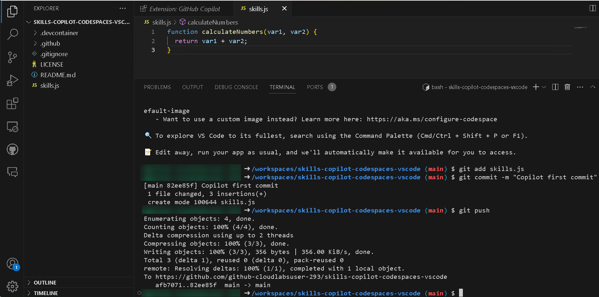
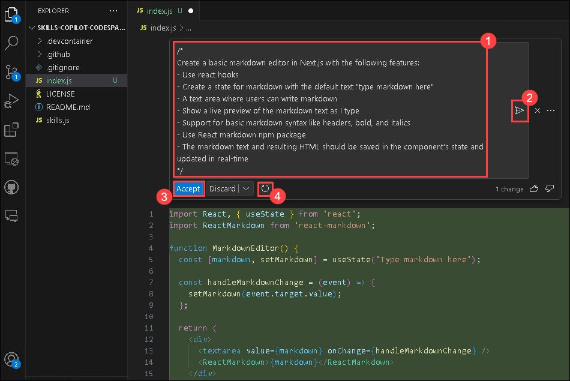

# Exercise 2: Seeing AI code suggestions in a JavaScript file

Duration: 30 minutes

While GitHub Copilot offers recommendations for many languages and frameworks, it excels in particular when it comes to Python, JavaScript, TypeScript, Ruby, Go, C#, and C++. The samples below are in JavaScript, but they should also work in other languages.

In this exercise, you will have the opportunity to experiment with and apply JavaScript with the assistance of GitHub Copilot and GitHub Copilot Chat.

>**Disclaimer**: A whole function body will be automatically suggested by GitHub Copilot in gray text. Here's an example of what you are likely to see; however, the precise recommendation could vary.

## Task 1: Add a JavaScript file and start writing code.

1. From the VS Code Explorer window, create a New File.

   

2. Name the file `skills.js` and verify your new file looks as shown below:

   

3. In the `skills.js` file, type the following function header. To open a new tab with multiple synthesized solutions, press `Ctrl+Enter`. GitHub Copilot will synthesize code suggestions in a new tab. You can view the solutions, and to accept a suggestion, you need to click on **Accept suggestion** below the solution and then press `Ctrl + S` to save the file

   ```
   function calculateNumbers(var1, var2)
   ```

   

## Task 2: Push code to your repository from the codespace

In this task, you will use the VS Code terminal to add the `skills.js` file to the GitHub repository.

1. Open VS Code Terminal by clicking on **Ellipsis (...)** **(1)**, select **Terminal** **(2)** and click on **New Terminal** **(3)**.

   

2. Run the below command to add the `skills.js` file to the GitHub repository.

   ```
   git add skills.js
   ```

3. Next, from the VS Code terminal stage, commit the changes to the repository:

   ```
   git commit -m "Copilot first commit"
   ```

4. Finally, from the VS Code terminal, push the code to the repository:

   ```
   git push
   ```

   

   >**Note**: Wait about 60 seconds, then refresh your GitHub repository landing page for the next step.


## Task 3: Best practices to use GitHub Copilot

### Verify GitHub Copilot Chat extension in VS Code

1. To Verify the GitHub Copilot Chat extension, the following steps are to be performed within Visual Studio Code:
    - Click on the **Extensions (1)** icon in the activity bar present on the left side of the Visual Studio Code Window.
    - In the "Search Extensions in Marketplace" search box, type and search for the **GitHub Copilot Chat (2)** extension.
    - Select **GitHub Copilot Chat (3)** from the list of results that show up, and verify that **GitHub Copilot Chat** has been installed.
    - If not, click on the **Install (4)** button.

   

1. Once the installation is complete, in the left navigation pane you will able to see the icon for GitHub Copilot Chat as shown below.

   

## Task 3.1- Example: Set the stage with a high-level goal

This is most helpful if you have a blank file or an empty codebase. In other words, it can be quite helpful to set the stage for the AI pair programmer if GitHub Copilot has no idea what you want to build or achieve. It helps to prime GitHub Copilot with a big-picture description of what you want it to generate—before you jump in with the details.

When prompting GitHub Copilot, think of the process as having a conversation with someone: How should I break down the problem so we can solve it together? How would I approach pair programming with this person?

1. From the VS Code Explorer window, create a New File.

   

2. Name the file `index.js` and verify your new file looks as shown below:

   

3. Now press `Ctrl + I` to open the GitHub Copilot Chat and paste the following **comment (1)** to fetch the code and click on Make request **(Enter) (2)** button and click on **Accept (3)** to use the code. If you want to regenerate the code, click on **Regenerate (4)** option.

   ```
   /*
   Create a basic markdown editor in Next.js with the following features:
   - Use react hooks
   - Create a state for markdown with the default text "type markdown here"
   - A text area where users can write markdown 
   - Show a live preview of the markdown text as I type
   - Support for basic markdown syntax like headers, bold, and italics 
   - Use React markdown npm package 
   - The markdown text and resulting HTML should be saved in the component's state and updated in real-time 
   */
   ```

   

4. This will prompt GitHub Copilot to generate the following code in the image and produce a very simple, unstyled, but functional markdown editor.

   

## Task 3.2- Example: Aim to receive a short output from GitHub Copilot for a simple and specific ask

After you've explained your primary objective to the AI pair programmer, explain the reasoning and procedures it must take to reach that objective. This will help GitHub Copilot gain a clearer understanding of your intended outcome when you break things down. For example, imagine you’re writing a recipe. Rather than writing a paragraph outlining the food you intend to make, you would break down the cooking procedure into distinct parts.
So, instead of asking GitHub Copilot to generate a large amount of code at once, let it generate the code after each step.

>**Note:** Add the following comments and accept the suggestion after the previous suggestion.

1. In the same index.js file, paste the following comment.
   
    ```
      // take a sentence as input
      // reverse the input sentence
      // the start of the sentence must start with a capital
      // for javascript
    ```
   
1. The generated outcome would look similar to the below image.

   


## Task 3.3- Example: Give GitHub Copilot an example or two

Not only can people benefit from learning from examples, but so can your AI pair programmer. For example, in order to take the names out of the data array below and put them in a
new array:

   ```
          const data = [
        [
          { name: 'John', age: 25 },
          { name: 'Jane', age: 30 }
        ],
        [
          { name: 'Bob', age: 40 }
        ]
      ];    
   ```

1. Type the below comment in the chat to generate the output without showing an example to GitHub Copilot.

   ```
    // As an illustration, pull names out of the data array  
   ```

2. It generated an incorrect usage of the map.

   

3. By contrast, paste the following **comment (1)**  to provide an example of how to generate the desired output and click on Make request **(Enter) (2)** button and click on **Accept (3)** to use the code. If you want to regenerate the code, click on **Regenerate (4)** option.

    ```
      // Map through an array of arrays of objects
      // Example: Extract names from the data array
      // Desired outcome: ['John', 'Jane', 'Bob']    
    ```

   
   
4. Now, we have received our desired outcome. Save the newly created `index.js` file by using the `CTRL + S` shortcut keys.

   

5. Open the **New Terminal** to push the code.

6. Run the below command to pull the latest changes.

   ```
   git pull
   ```

1. Run the below command to add the `index.js` file to the GitHub repository.
   
   ```
   git add index.js
   ```

8. Next from the VS Code terminal, commit the changes to the repository:

   ```
   git commit -m "Copilot commit"
   ```

9. Finally, from the VS Code terminal, push the code to the repository:

   ```
   git push
   ```

   >**Note**: Please run **git stash** command in case of an error and run all the commands again.
   
   >**Note**: Wait about 60 seconds, then refresh your GitHub repository landing page for the next step.

10. Click on **Next** from the bottom right to continue with the next exercise.

### Summary

In this exercise, you have successfully generated JavaScript code and other best practices using GitHub Copilot and GitHub Copilot Chat.
