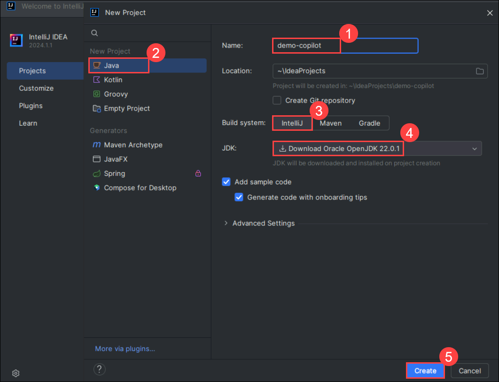
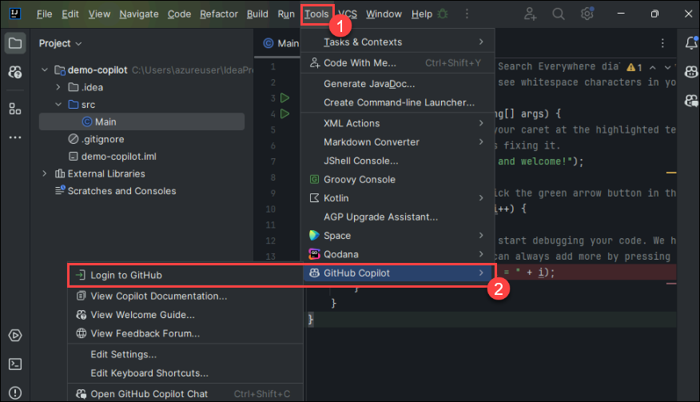
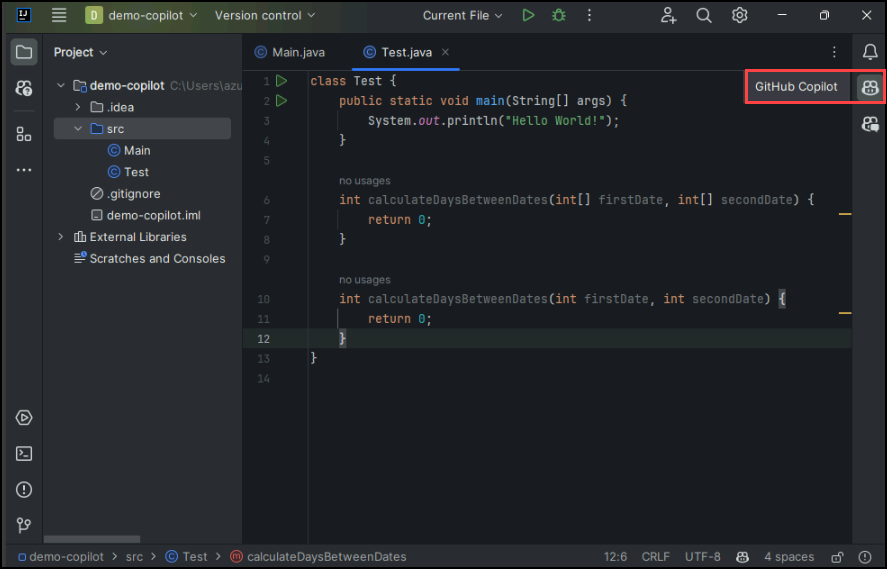

# Exercise 6: Using IDEs such as JetBrains IntelliJ for Java

Duration: 40 minutes

GitHub Copilot, an innovative code generation tool, can be integrated with JetBrains IntelliJ, a widely used IDE for Java development. This integration enhances the Java coding experience by providing intelligent code suggestions and auto-completion within IntelliJ, boosting productivity and code quality.

In this exercise, you will use the JetBrains IntelliJ Idea IDE for Java. You will install the GitHub Copilot plugin and create a new project.

>**Disclaimer**: GitHub Copilot will automatically suggest an entire function body or code in gray text. Examples of what you'll most likely see in this exercise, but the exact suggestion may vary.

>**Note**: If you are unable to see any suggestions by GitHub Copilot in VS Code, please restart the VS Code once and try again.

## Task 1: Install the GitHub Copilot plugin and create a new project in the IntelliJ Idea IDE

1. Navigate to the desktop and open the **IntelliJ IDEA Community** IDE.

   

1. In the IntelliJ IDEA Agreement, check **I confirm that I have read and accept the terms of this User Agreement (1)** and click on **Continue (2)**.

   

   >**Note:** When the data sharing box appears, click on **Don't Send**.

   

1. From the left menu, click on **Plugins** **(1)** and select **Marketplace** **(2)**. Search **GitHub Copilot** **(3)**, and once you find **GitHub Copilot** plugin, click on **Install** **(4)**.

   

   >**Note** : In the Third-Party Plugins notice, click **Accept**.

1. Verify the GitHub Copilot plugin is installed. Next, you need to restart the IDE by clicking on **Restart IDE**. Click on **Restart** in the pop-up once again to restart the IDE.

   .png)

1. Once the **IntelliJ Idea Community** IDE is restarted, select **Projects** **(1)** from the left menu and click on **New Project** **(2)**.

   

1. In the new project pane, enter the project name as **demo-copilot** **(1)**. Select language as **Java** **(2)** and build system as **IntelliJ** **(3)**. For JDK, select the default **Download Oracle OpenJDK 22** **(4)** and click on **Create** **(5)**.

   

1. Review the created **demo-copilot** project as shown below:

   

## Task 2: Create a basic Java project

1. Click the **icon** as shown in the below image. 

   

1. Click on **Tools (1)**. Click GitHub Copilot, then click **Login to GitHub (2)**.

   

1. In the "Sign in to GitHub" dialog box, to copy the device code and open the device activation window, click **Copy and Open**.

   

1. A device activation window will open in your browser. Paste the device **code (1)** which you have copied in the previous step, then click **Continue (2)**.

   

1. GitHub will request the necessary permissions for GitHub Copilot. To approve these permissions, click **Authorize GitHub Copilot Plugin**.

1. After the permissions have been approved, your JetBrains IDE will show a confirmation.

   

1. In your JetBrains IDE, right-click on the **src (1)**, select **New (2)** and click on **File (3)** to create a new Java (*.java) file named **Test.java**.

   

1. Create a class by typing **class Test**. Copilot will suggest a class body, and you can press **tab** to accept the suggestion.

   

1. Below the bracket of the main function, type the following function header:

   ```
   int calculateDaysBetweenDates(
   ```

1. GitHub Copilot will automatically suggest an entire function body in gray text, as shown below. The exact suggestion may vary.

   

1. Press **Tab** to accept the suggestion.


## Task 3: Getting more suggestions

Sometimes, you may not want to use any of the initial suggestions. You can ask GitHub Copilot to return more.

1. Remove the function you entered and type the following again:

   ```
   int calculateDaysBetweenDates(
   ```

1. Open GitHub Copilot.

   -On macOS, press `Option + Enter`.

   -On Windows or Linux, press `Alt + Enter`.
   
   >**Note**: If the 'Alt + Enter' isn't working, please select Github Co-pilot from the right pane as shown in the below image.

   
   
1. Select "Open Copilot". GitHub Copilot will open a new tab and suggest multiple options, as shown below.

   

1. Pick a suggestion that you want to use, then click "Accept solution".

1. If you don't like any of the returned suggestions, just close the suggestions tab.


## Task 4: Getting code from a comment

GitHub Copilot can understand significantly more context than most code assistants and can generate entire functions from something as simple as a comment.

1. Remove the function you entered and type the following comment:
   
   ```
   // Identify all the images without alternate text
   // and add a red border to them
   void process(java.util.List<Image> images) {  

   ```

2. GitHub Copilot will automatically suggest an implementation.
  
   

   <validation step="364115e7-deff-4c32-96e9-fa5d2122a86f" />

3. Click on **Next** below to move on to the next page.

      > **Congratulations** on completing the task! Now, it's time to validate it. Here are the steps:
       
      - Go to the **Lab Validation** tab.
      - Click on the **Validate** button under the **Actions** section for *Exercise 6: Using other IDEs like JetBrains IntelliJ for Java*
      - A success message indicates you’re ready for the next task. Proceed accordingly.
      - If not, review the message, revisit the lab guide, and attempt the step again.
      - If you need any assistance, please contact us at labs-support@spektrasystems.com. We are available 24/7 to help you out.
        
### Summary

In this exercise, you have successfully configured the JetBrains IntelliJ Idea IDE for Java, installed the GitHub Copilot plugin, and explored the basic Java code that produced the
suggestions using Copilot.
