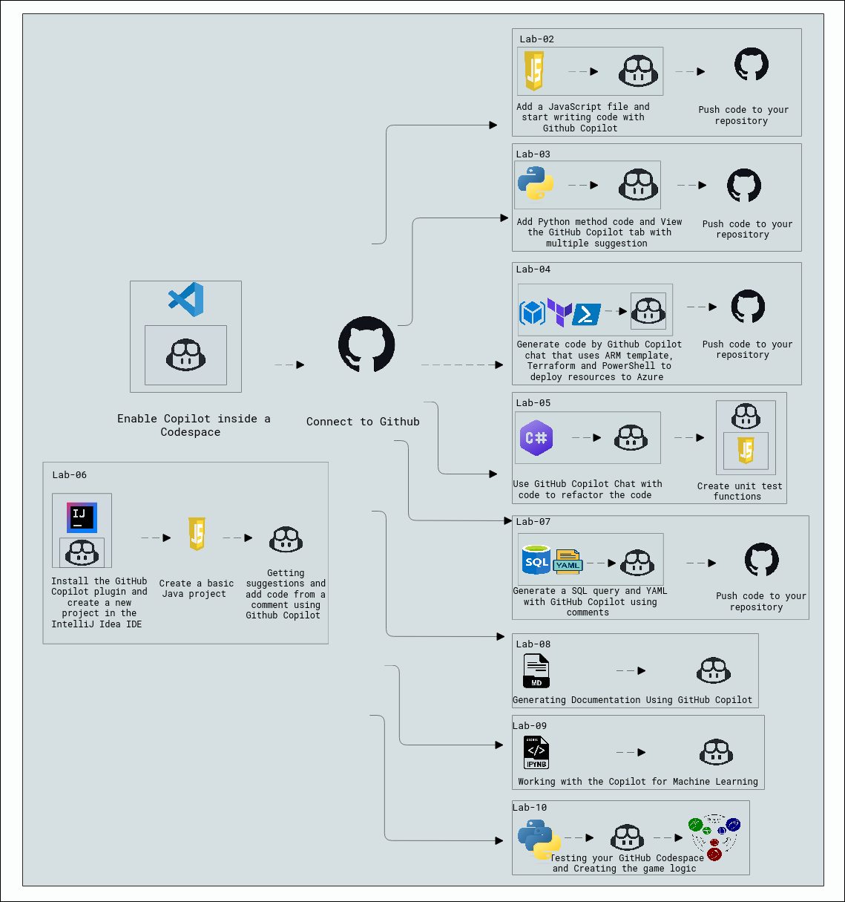

# Lab Scenario Preview: Github-Copilot

## Lab Overview

GitHub Copilot is an AI pair programmer speeding up coding with instant suggestions from comments and code context. Powered by OpenAI Codex, it excels in Python, JavaScript, TypeScript, Ruby, Go, C#, and C++. Github Copilot Chat offers coding assistance directly in supported IDEs, including code suggestions, descriptions, unit test generation, bug fixes, and refactoring. Integrated with JetBrains IntelliJ, it enhances Java coding with intelligent suggestions. Copilot also assists in generating T-SQL and YAML code, streamlining documentation with auto-generated comments, creating Markdown documentation, grammar consistency, and cross-referencing. It also aids in crafting console applications using different programming languages, leveraging AI-powered completion.

## Lab Objectives

In this lab, you will perform:

- Leverage Codespaces with VS Code for Copilot
- View AI-generated code suggestions.
- Utilize the GitHub Copilot tab to view multiple suggestions.
- Leverage GitHub Copilot Chat for generating ARM and Terraform code alongside Copilot.
- Leverage GitHub Copilot for code refinement.
- Utilize IDEs like JetBrains IntelliJ for Java development.
- Harness GitHub Copilot for T-SQL and YAML code generation.
- Generate Documentation Using GitHub Copilot
- Work with the Copilot for Machine Learning
- Develop a Mini Game using GitHub Copilot

## Estimated Timing: 8 hours

## Solution Architecture

Once you understand the lab's content, you can start the hands-on lab by clicking the **Launch** button located in the top right corner. 
This will lead you to the lab environment and guide. You can also preview the full lab guide [here](https://experience.cloudlabs.ai/#/labguidepreview/cb411b13-5340-498e-a4c4-01d029a436eb)
if you want to go through a detailed guide prior to launching the lab environment. 
